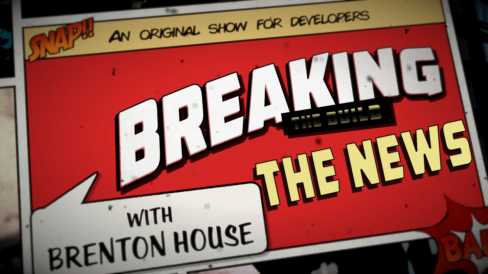

# 🚨Breaking the Build! 🚨

## Episode 03: Apple 2019 Special Event

> https://www.youtube.com/watch?v=gIRUrIzgPM0

* [Episode 03: Apple 2019 Special Event](#episode-03-apple-2019-special-event)
* [📝 Description](#-description)
* [Show Notes](#show-notes)
	* [New and Updated Apple products](#new-and-updated-apple-products)
	* [Things not covered in this event](#things-not-covered-in-this-event)
* [🔗 Links](#-links)
* [👏 Credits](#-credits)
* [📚Learn More](#learn-more)
* [📣 Feedback](#-feedback)

## 📝 Description

> 🍎 Today we cover the Apple 2019 Special Event and all the new things that Apple announced!

## Show Notes

### New and Updated Apple products

✅  iPhone 11   
✅  iPhone 11 Pro   
✅  iPhone 11 Pro Max  
✅  Apple Watch Series 5         
✅  iPad Generation 7     
✅  "Ultra-Wide" Camera on iPhones   
✅  "Slofie" and the slo-mo front facing camera      
✅  Extended battery life on iPhones   
✅  iPhones shipping with 18w charger      
✅  New iPhone colors available  
✅  iPhone camera - Night Mode    
✅  iPhone camera - "Pet Portrait" Mode    
✅  3D Touch Gone    
✅  Apple Watch 18H "Always On" display     
✅  Apple Arcade - $4.99 / month    
✅  Apple TV+ - $4.99 / month         
✅  Apple TV+ - Free for 1 year with iPhone purchase     
      

### Things not covered in this event

❌ USB-C connector   
❌ Apple Pencil Support   
❌ Apple Tile Competitor   
❌ Return of Touch ID   
❌ Reverse Wireless Charging   
❌ Apple Watch Sleep Tracking   
❌ MacBook 16   

## 🔗 Links

* [In-screen fingerprint reader](https://www.bloomberg.com/news/articles/2019-09-05/apple-working-on-in-display-fingerprint-id-for-future-iphones) 
*  [Apple Event on YouTube](https://www.youtube.com/watch?v=-rAeqN-Q7x4)

Subscribe to our channel and hit the 🔔 to get notified when we've posted a new episode!

Enjoy this episode? 👍 Like our video and share it!

This show was created by the Axway Developer Relations Team and many others at Axway!

## 👏 Credits

* Executive Producer:  Todd Holbrook 
* Marketing and Communications: Josh Molina
* Host / Developer Relations:  [Brenton House](https://brenton.house)

## 📚Learn More

Check out the developer resources available below!

* Axway Developer Blog - https://devblog.axway.com
* Axway Titanium Overview - https://breakingthebuild.dev/titanium
* Axway Developer Slack Channel - https://breakingthebuild.dev/slack
* Axway Developer Portal - https://developer.axway.com/

## 📣 Feedback

Have an idea or a comment?  [Join in the conversation here](https://github.com/axway-developer-relations/breaking-the-build/issues)! 

