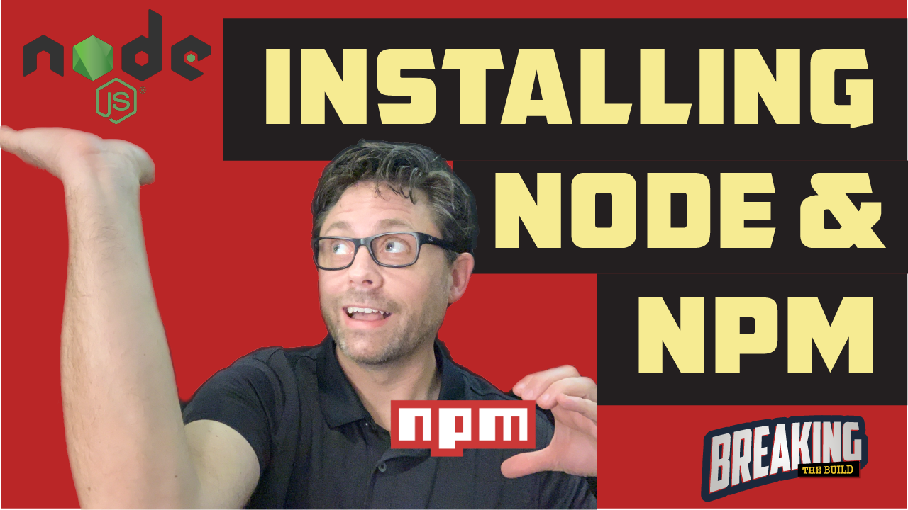

# 🚨Breaking the Build! 🚨

## Episode 04: Installing and Managing Node.js and npm

> https://www.youtube.com/watch?v=viw8700hq38

* [Episode 04: Installing and Managing Node.js and npm](#episode-04-installing-and-managing-nodejs-and-npm)
* [📝 Description](#-description)
* [🔗 Links](#-links)
* [👏 Credits](#-credits)
* [📚Learn More](#learn-more)
* [📣 Feedback](#-feedback)

## 📝 Description

> 🔧 Need to do JavaScript development?  You probably need Node.js and npm.  Join us as we cover installing and managing Node.js, npm, and some other tools to help you be successful quicker!

## 🔗 Links

📌 Node.js - [https://nodejs.org](https://nodejs.org)   
📌 npm - [https://www.npmjs.com/](https://www.npmjs.com/)   
📌 nvm - [https://breakingthebuild.dev/nvm](https://breakingthebuild.dev/nvm)   

**Subscribe to our channel and hit the 🔔 to get notified when we've posted a new episode!**

Enjoy this episode? 👍 Like our video and share it!

This show was created with ❤️ by the Axway Developer Relations Team and many others at Axway!

## 👏 Credits

⭐ Executive Producer:  Todd Holbrook    
⭐ Marketing and Communications: Josh Molina   
⭐ Host / Developer Relations:  [Brenton House](https://brenton.house)   

## 📚Learn More

Check out the developer resources available below!

⭐ Axway Developer Blog - [https://devblog.axway.com](https://devblog.axway.com)  
⭐ Axway Titanium Overview - [https://breakingthebuild.dev/titanium](https://breakingthebuild.dev/titanium)   
⭐ Axway Developer Slack Channel - [https://breakingthebuild.dev/slack](https://breakingthebuild.dev/slack)   
⭐ Axway Developer Portal - [https://developer.axway.com/](https://developer.axway.com/)   

## 📣 Feedback

Have an idea or a comment?  [Join in the conversation here](https://github.com/axway-developer-relations/breaking-the-build/issues)! 

