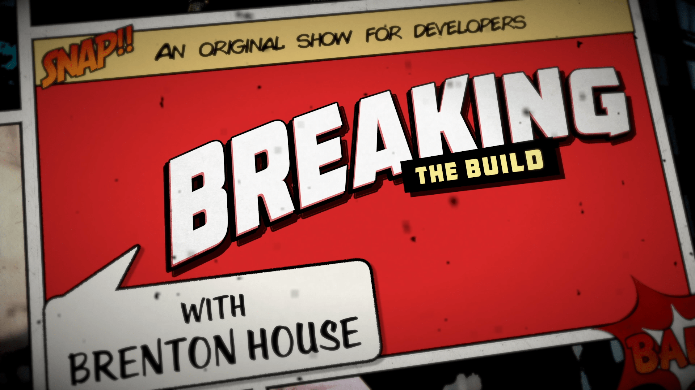

# 🚨Breaking the Build! 🚨

> Breaking the Build is an Axway original show for developers.  This show will take a lighter look at life as a developer while providing answers and solutions to real-world issues that they face.  

This show premiered on August 14, 2019 and is hosted by [Brenton House](https://brenton.house).

* [🎬 Episodes](#-episodes)
* [▶️ Axway Developer YouTube Channel](#️-axway-developer-youtube-channel)
* [👏 Credits](#-credits)
* [📚Learn More](#learn-more)
* [📣 Feedback](#-feedback)

## 🎬 Episodes

* [Episode 01:  Tabs vs Spaces](./episodes/episode-01-tabs-vs-spaces/readme.md)
* [Episode 02:  Surviving the Crash](./episodes/episode-02-surviving-the-crash/readme.md)
* [Episode 03:  Apple 2019 Special Event](./episodes/episode-03-apple-2019-event/readme.md)
* [Episode 04:  Installing and Managing Node.js and npm](./episodes/episode-04-nodejs-and-npm/readme.md)

## ▶️ Axway Developer YouTube Channel

> https://youtube.com/axwaydev

Here you will find some of our popular tutorials and demos along with some fresh new content. Axway Developer Relations and Video Production teams have been reviewing and implementing the feedback from the developers around the world and felt it was time to give something back to you: The Development Community!

We are still cooking up some special features but here are some of the things you can expect to see in this new YouTube channel:

* Mobile Development and Architecture
* API Management Development and Configuration
* Mobile App Design and Best Practices
* API Development Tool Reviews
* Mobile UI/UX Best Practices
* API and Microservices Development and Architecture
* Mobile Development Tool Reviews
* Mobile and API Integration Tutorials and Best Practices
* Application and Enterprise Architecture
* Integration Development and Architecture
* Content Collaboration Development for Enterprise Solutions
* LiveStreams of events, coding sessions, and how-to videos
* and much, much more!

## 👏 Credits

* Executive Producer:  Todd Holbrook 
* Marketing and Communications: Josh Molina
* Host / DevRel:  [Brenton House](https://brenton.house)

## 📚Learn More

Check out the developer resources available below!

* Axway Developer Blog - https://devblog.axway.com
* Axway Titanium Overview - https://breakingthebuild.dev/titanium
* Axway Developer Slack Channel - https://breakingthebuild.dev/slack
* Axway Developer Portal - https://developer.axway.com/

## 📣 Feedback

Have an idea or a comment?  [Join in the conversation here](https://github.com/axway-developer-relations/breaking-the-build/issues)! 

